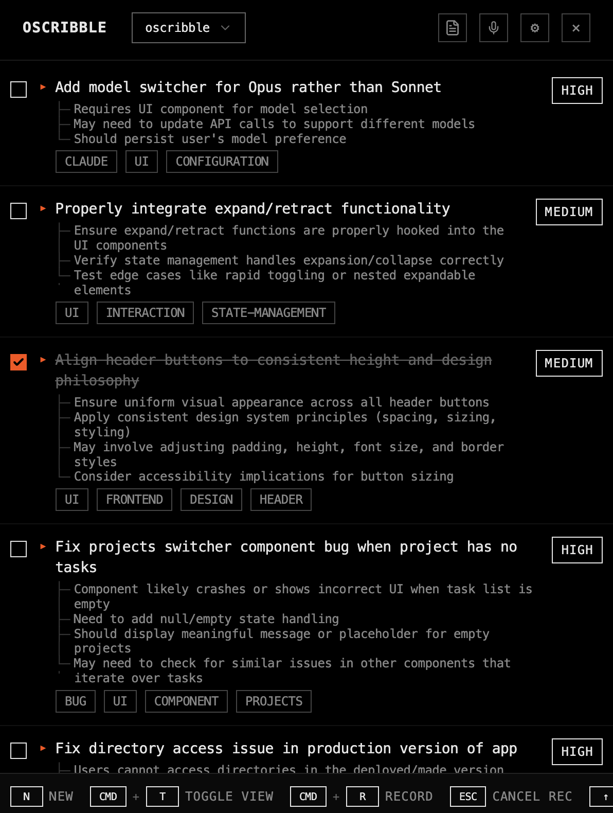

# oscribble

raw notes → structured tasks.
brutalist task manager. claude ai.



## what it does

- raw text becomes prioritized task lists
- model selection. choose balanced (haiku+sonnet), sonnet (intelligent), or haiku (fast).
- voice input. toggle record `CMD+R`. transcribe via openai.
- `@mentions` load file context for smarter task analysis
- auto-context discovery. claude finds relevant files automatically.
- dual format modes. `CMD+Enter` with context. `CMD+Shift+Enter` without.
- context tracking. see which files informed each task.
- web search integration. claude searches when uncertain (life admin tasks).
- clickable citations. sources open in browser.
- task timing. automatic duration tracking for completed tasks.
- few-shot learning. time estimates improve from your completion history.
- hierarchical tasks. expand/collapse. arrow keys.
- multi-select tasks. `Shift+↑↓`. batch operations.
- dependency detection. blocked task flags.
- multi-project. quick switch `CMD+K`.
- keyboard-first. no mouse required.
- monochrome + orange. terminal aesthetic.

## install

download `.dmg` from [releases](https://github.com/oscargavin/oscribble/releases)

**macos security note:** unsigned app requires terminal command after install:
```bash
sudo xattr -cr /Applications/Oscribble.app
```
then launch normally. enter [anthropic api key](https://console.anthropic.com/) on first run.

### build from source

```bash
git clone https://github.com/oscargavin/oscribble.git
cd oscribble
npm install
npm start
```

requires node 18+, macos 11+

## use

write raw notes. `CMD+Enter` to format with context.
claude auto-discovers relevant project files.
`@filepath` mentions force specific files.
use `CMD+Shift+Enter` for instant formatting without context.
arrow keys navigate. `Shift+↑↓` multi-select.
`Space` toggles done. `CMD+O` shows context used.

### keyboard shortcuts

```
CMD+Enter       format with auto-context
CMD+Shift+Enter format without context (instant)
CMD+K           quick project switcher
CMD+1-9         switch to project (alphabetical)
CMD+T           toggle raw/tasks view
CMD+R           toggle voice recording
CMD+O           show context files (focused/selected tasks)
ESC             cancel recording

↑/↓         navigate
Shift+↑/↓   multi-select tasks
←/→         collapse/expand
Space       toggle complete (single/batch)
C           deselect all
N           new task
M           edit metadata
R           edit dependencies
Delete      remove task (single/batch)

1-5         filter: unchecked/complete/all/critical/blocked
```

## how it works

### intelligent context loading
when you format tasks with `CMD+Enter`, oscribble automatically:
1. scans your task text for `@filepath` mentions
2. discovers relevant files from your project (if no mentions)
3. caches file content (7-day expiry)
4. sends context to claude for smarter task analysis

see which files claude used: press `CMD+O` on any task.

**instant formatting**: use `CMD+Shift+Enter` to skip context gathering.
faster results, but less context-aware task analysis.
useful when you want instant formatting or work with non-code projects.

### task timing & learning
complete a task → duration automatically logged.
next format → claude sees your completion history.
time estimates improve from your patterns (last 10 tasks).

active tasks show pulsing orange indicator.

### web search for life admin
life admin tasks (passports, taxes, appointments) use claude's web search:
- claude decides when to search based on confidence
- searches government sites, official docs, current requirements
- location-aware (set city/region/country in settings)
- sources embedded as clickable citations `[1]` `[2]`
- click citation → opens source url in browser

ui state: `FORMAT` → `SEARCHING` → `ANALYZING` → `FORMATTING`

if analyzing takes >20s, switches to `SEARCHING` (likely web searching).

### filtering & views
default view: unchecked tasks only.
press `1-5` to switch filters:
- `1` unchecked (active work)
- `2` completed (done)
- `3` all tasks
- `4` critical priority
- `5` blocked by dependencies

empty state shows helpful shortcuts.

## data

stored in `~/.project-stickies/`
```
settings.json         # api keys, current project, location
projects.json         # project registry
{project}/
  notes.json          # structured tasks (with citations)
  raw.txt             # autosaved input
  completion_log.json # task timing history (last 10 completions)
  .context-cache/     # file context cache (7 day expiry)
```

## settings

configure in settings panel:

**api keys**
- anthropic (required): task formatting via claude
- openai (optional): voice transcription

**model selection**
- balanced (default): haiku for autocontext, sonnet for task generation
- sonnet 4.5: intelligent, best for complex analysis
- haiku 4.5: fast, economical, best for simple tasks

color indicator in header shows active model (deep/mid/light orange).

**location** (optional)
- city, region, country for localized web search results
- used for life admin tasks (e.g., irish passport requirements)

**personal context**
- add custom info to personalize task suggestions
- examples: work schedule, tax year, preferences

get keys: [anthropic](https://console.anthropic.com/) • [openai](https://platform.openai.com/api-keys)

## dev

```bash
npm start           # dev mode, devtools open
npm run lint        # check typescript
npm run make        # build installer
```

electron + react + claude sonnet 4.5

## contributing

contributions welcome! oscribble is open source and we'd love your help.

**ways to contribute:**
- report bugs via [issues](https://github.com/oscargavin/oscribble/issues)
- suggest features or improvements
- submit pull requests with fixes or enhancements
- improve documentation
- share your experience and use cases

**submitting prs:**
1. fork the repo
2. create a feature branch (`git checkout -b feature/amazing-feature`)
3. commit your changes (`git commit -m 'add amazing feature'`)
4. push to your fork (`git push origin feature/amazing-feature`)
5. open a pull request

**development notes:**
- follow existing code style
- test your changes thoroughly
- update docs if you add/change features
- keep commits focused and atomic

questions? open an issue or start a discussion.

## mcp integration

use oscribble from claude code. control tasks via natural language.

add to `~/.claude/claude_desktop_config.json`:
```json
{
  "mcpServers": {
    "oscribble": {
      "command": "npx",
      "args": ["-y", "@oscargavin/oscribble-mcp"]
    }
  }
}
```

ask claude code: "show unchecked tasks" • "complete task xyz" • "add task: fix auth bug"

[mcp docs](docs/mcp-integration.md) • [mcp repo](https://github.com/oscargavin/oscribble-mcp)

---

mit license.
not affiliated with anthropic. byok.
